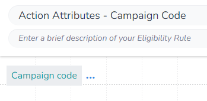

In this example we will get the most recent `Datetime of Last Neutral Click` for all `Actions` whose name includes "Usecase - Popup".

First we need to make a supporting rule that gets us the `Campaign Code` assigned to the `Action` that `MXO` is evaluating the `Eligibility` for:

As we are aggrigating, we first need to select which aggrigation `function` we are using. We will be using `Latest date in` to get the value of `Datetime of Last Neutral Click` from the matching `Actions`:

Next we open the `DIP`, select the field we want:

After we apply our filter:

Finally, we save our rule:

