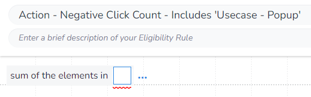
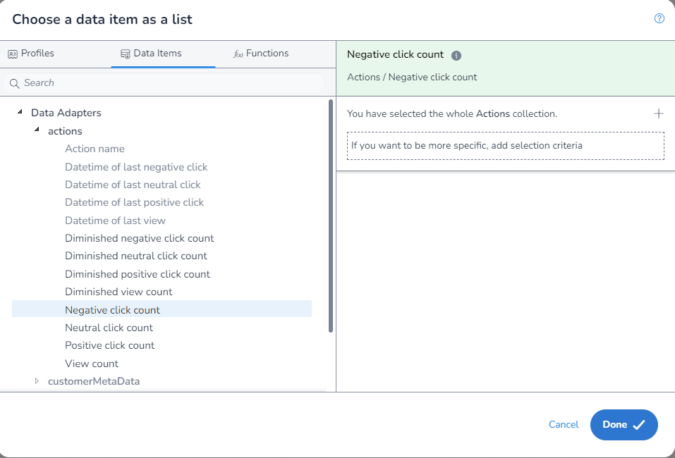
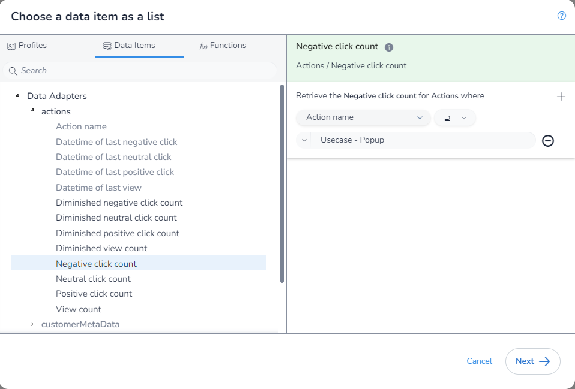
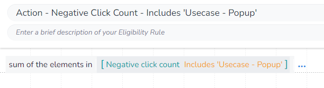

In this example we will get the `Negative Click Count` for all `Actions` whose name includes "Usecase - Popup".

As we are aggrigating, we first need to select which aggrigation `function` we are using. We will be using `Sum of the elements in` to get the value of `Negative Click Count` for each matching `Action`:

Next, we open the `DIP`, select the field we want:

You will notice that as we have used this `function`, when we enter the `DIP` we are limted to only fields that return a `number` and that we are not required to apply any filters.

Next, we apply our filter:

Finally, we save our rule:

