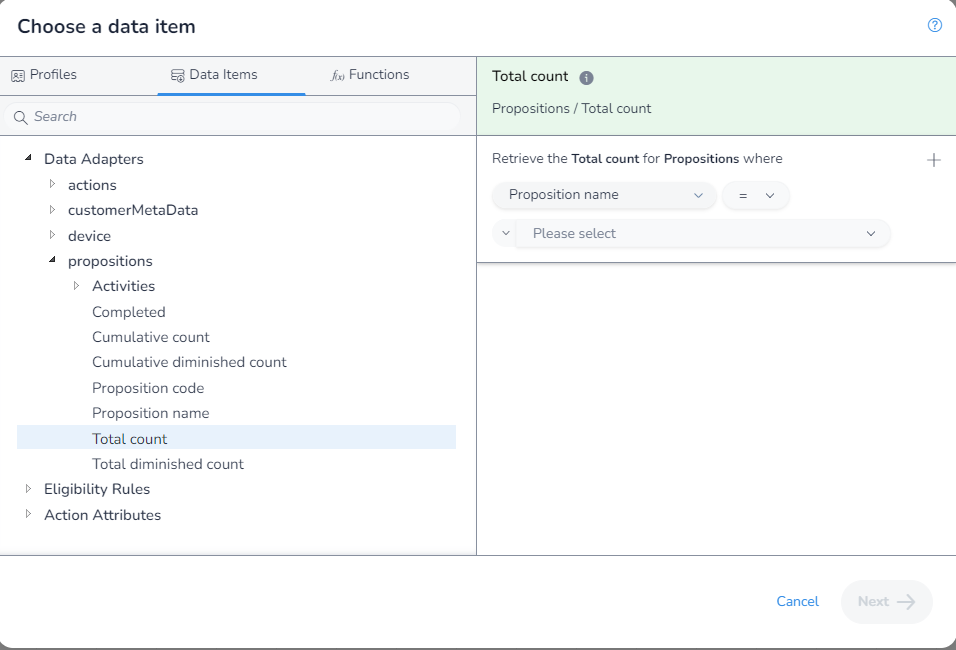
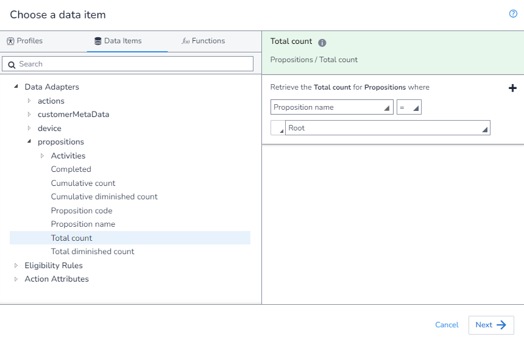
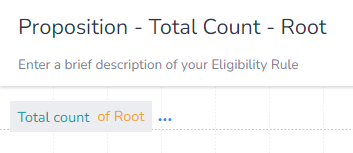

In this example, we will get the `Total Count` where the `Proposition` is "Example"

As there is no aggrigation needed, we first open the `DIP`, select the field we want:

Next, we apply our filter:

Finally, we save our rule:

