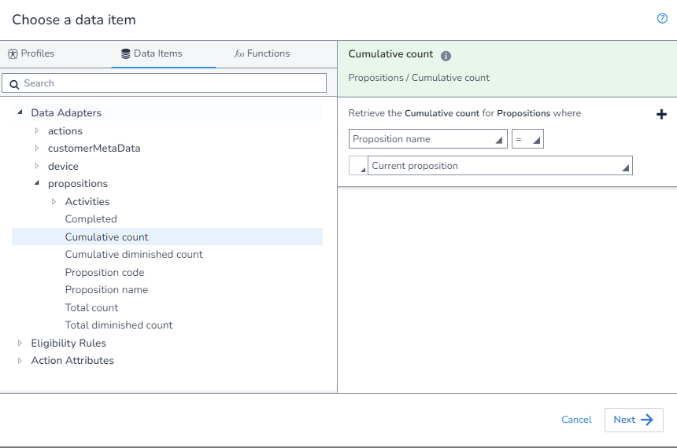

In this example, we will get the `Cumulative Count` where the `Proposition` is the Proposition we have assigned to the `Action` that `MXO` is evaluating the `Eligibility` for.

As there is no aggrigation needed, we first open the `DIP`, select the field we want:

Next, we apply our filter.  We do this by selected the option `Current proposition` from the drop down:

Finally, we save our rule:

