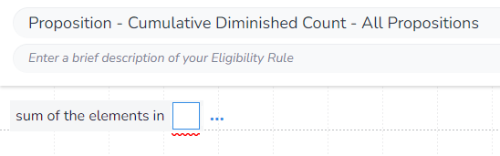
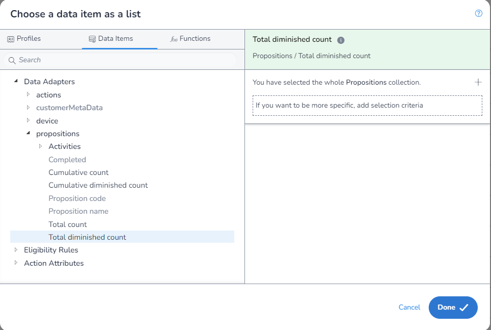
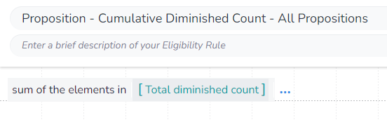

In this example, we will calculated the `Cumulative Diminished Count` for all `Propositions`. To do this, it is recommended to use the Specific `Proposition` method and select the top level `Proposition`, but we will cover how to do it using the aggrigate method for completion.

Whilst we are getting to `Cumulative Diminished Count`, we will be using the field `Total Diminished Count` as we will be summing the individual `Propositions` manually.

As we are aggrigating, we first need to select which aggrigation `function` we are using. We will be using `Sum of the elements in` to get the value of `Total Diminished Counts` for each matching `Proposition`:

You will notice that as we have used this `function`, when we extern the `DIP` we are limted to only fields that return a `number` and that we are not required to apply any filters:

We will leave the filter empty so that all `Propositions` will be returned.

We can now save our rule:

