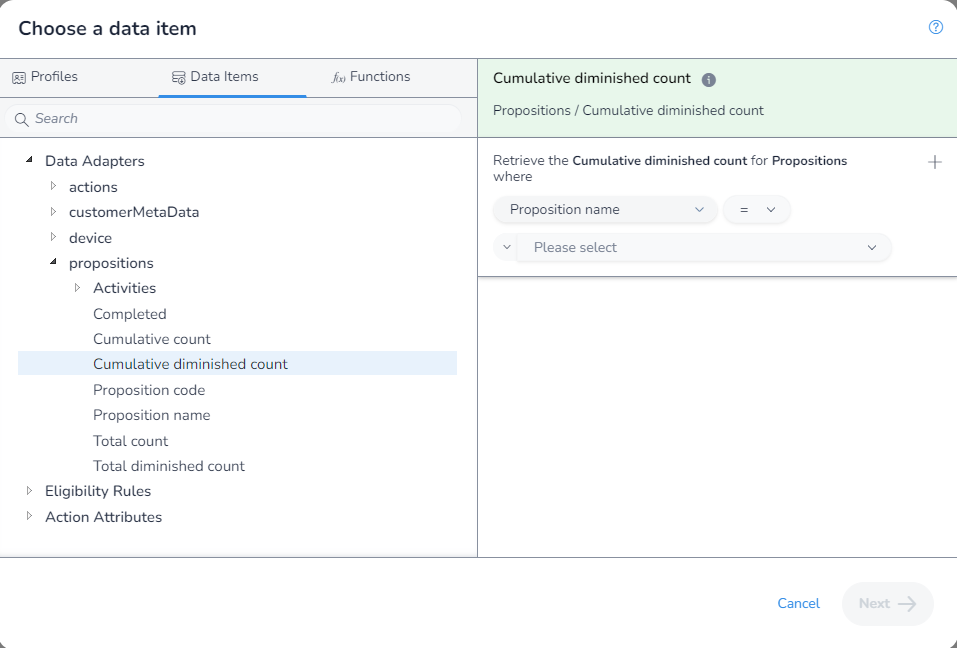
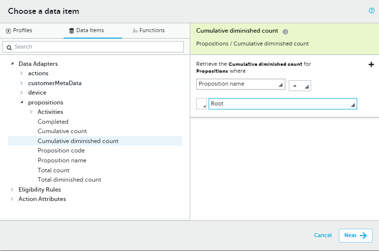
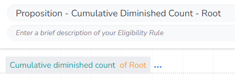

In this example we will get the `Cumulative Diminished Count` where the `Proposition` is the "Root".

As there is no aggrigation needed, we first open the `DIP`, select the field we want:

Next we apply our filter:

Finally, we save our rule:

