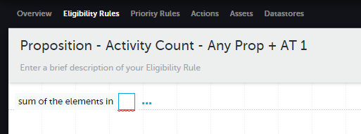
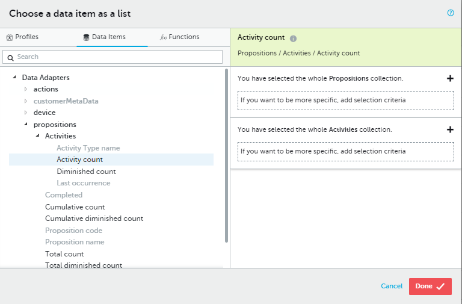
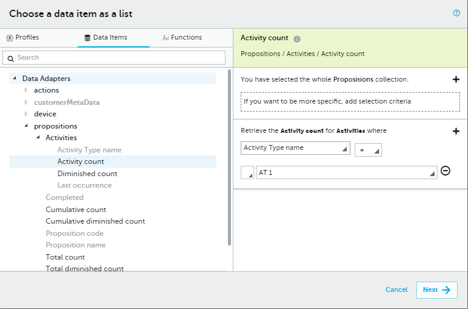
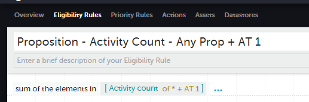

In this example we will get the `Activity Count` where the `Proposition` can be anything and the `Activity Type is "AT 1`.

As we are aggrigating, we first need to select which aggrigation `function` we are using. We will be using `Sum of the elements in` to get the total number of `Activity Count` for each matching `Proposition` & `Activity Type`:

Next, we open the `DIP`, select the field we want:

You will notice that as we have used this `function`, when we enter the `DIP` we are limted to only fields that return a `number` and that we are not required to apply any filters.

Next, we will leave the `Proposition` filter blank, and apply our `Activity Type` filter:

Finally, we save our rule:

