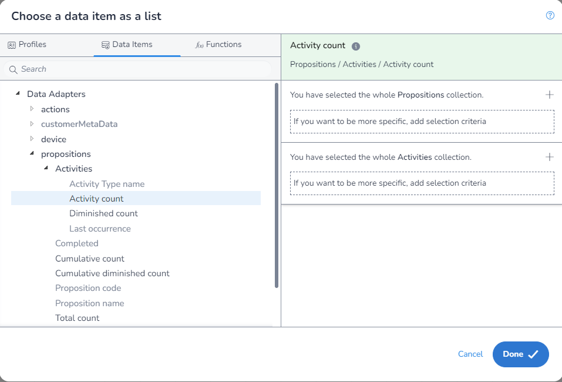

In this example, we will get the sum of `Activity Counts` where the `Proposition` is the children of the `Proposition` we have assigned to the `Action` that `MXO` is evaluating the `Eligibility` for but not itself, and the `Activity Type` is "AT 1".

First, we need to make a supporting rule that gets us the `Proposition Path` assigned to the `Action` that `MXO` is evaluating the `Eligibility` for:

We can then save this rule:

This `Proposition Path` will match the `Proposition` we have assigned to our `Action` and its children, but we only want it to match the children. To do this we need to append an "/" onto the end of our `Proposition Path` so the parent `Proposition` will no longer match:

As we are aggrigating, we first need to select which aggrigation `function` we are using. We will be using `Sum of the elements in` to get the total number of `Activity Count` for each matching `Proposition` & `Activity Type`:

Next, we open the `DIP`, select the field we want:

You will notice that as we have used this `function`, when we enter the `DIP` we are limted to only fields that return a `number` and that we are not required to apply any filters.

We will select the rule we made for the `Proposition`, and apply our `Activity Type` filter:

Finally, we save our rule:

