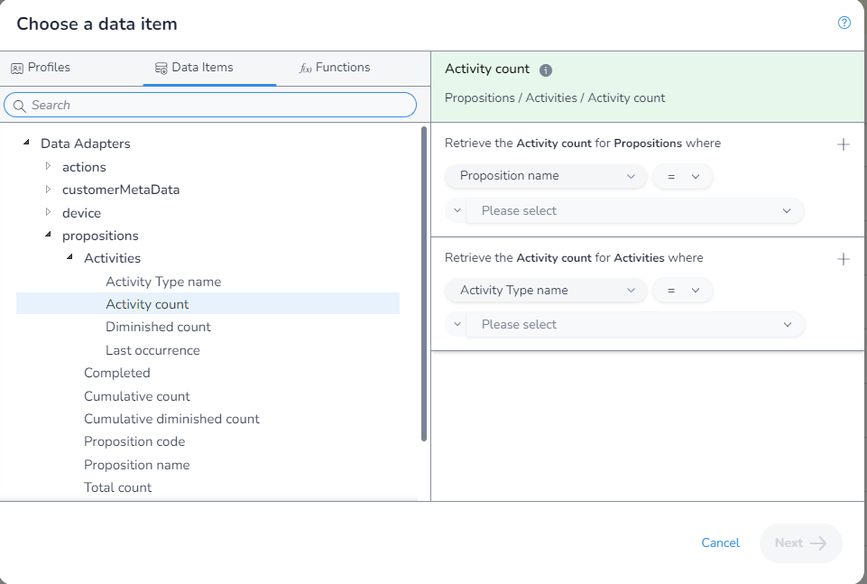
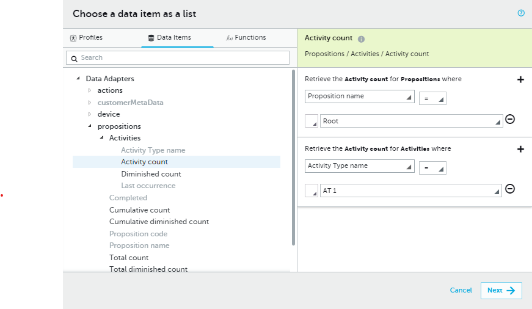
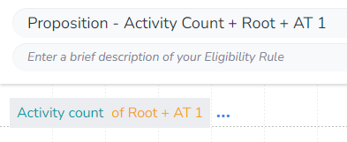

In this example, we will get the `Activity Count` where the `Proposition` is "Root", and the `Activity Type` is "AT 1".

As there is no aggrigation needed, we first open the `DIP`, select the field we want:

Next we apply our filter:

Finally, we save our rule:

