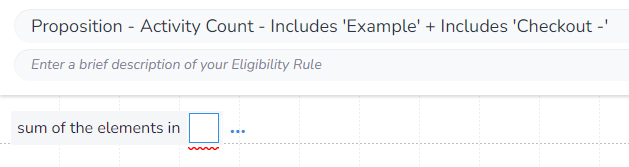
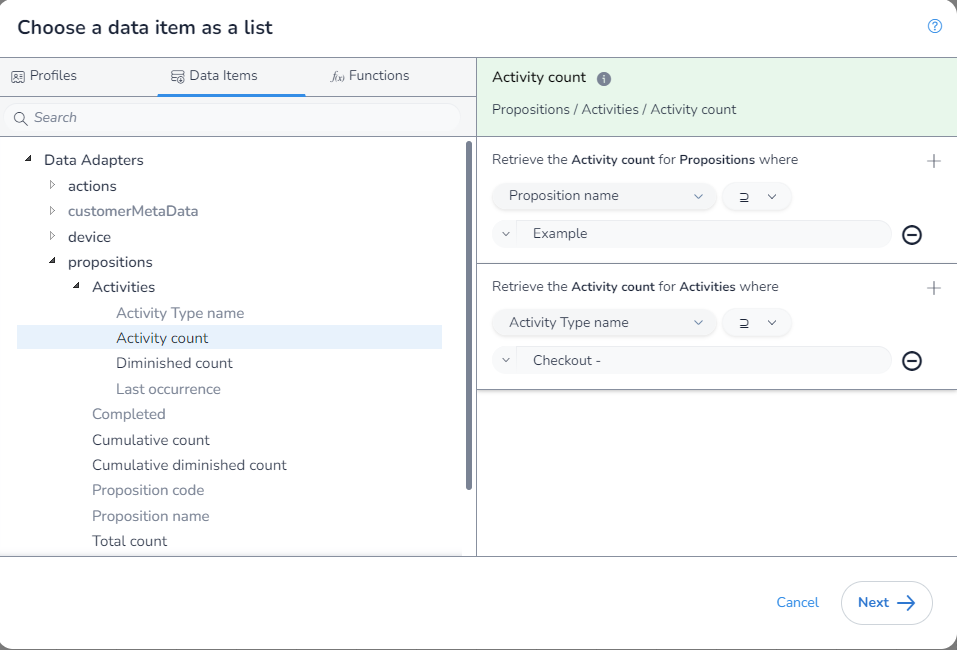
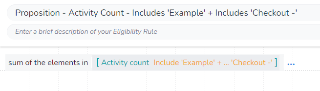

In this example we will get the sum of `Diminished Activity Count` where the `Proposition Name` includes "Example", and the `Activity Type` contains the text "Checkout -".

The `Proposition Name` in the `Proposition` `Data Adapter` is actually the full `Proposition Path`. This means that when you using the `includes` filter, this will match the parent and all children as the `Proposition Path` of the child will contain the `Proposition Path` of the parent.

As we are aggrigating, we first need to select which aggrigation `function` we are using. We will be using `Sum of the elements in` to get the value of `View Count` for each matching `Action`:

Next, we open the `DIP`, select the field we want:

You will notice that as we have used this `function`, when we enter the `DIP` we are limted to only fields that return a `number` and that we are not required to apply any filters.

Next, we apply our filter:

Finally, we save our rule:

