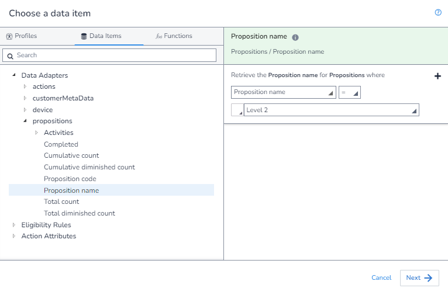
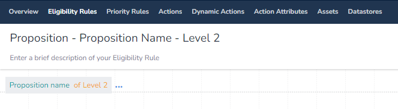
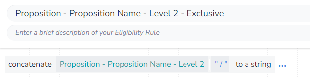
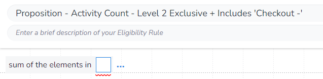
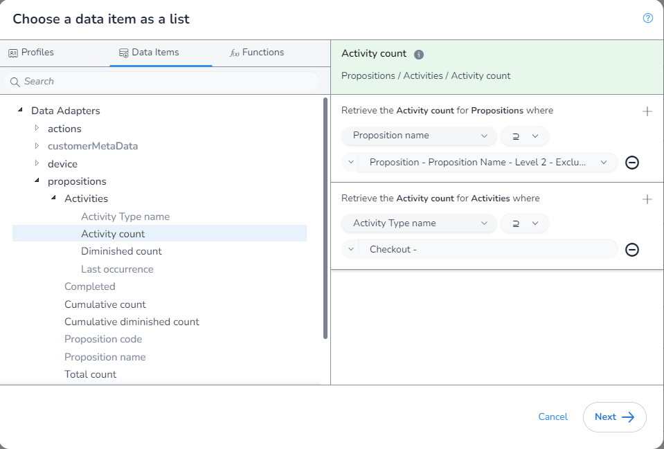
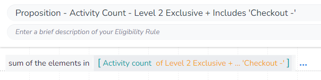

In this example, we will get the sum of `Last Occurrences` where the `Proposition` is the children of the `Proposition` "Level 2" but not itself, and the `Activity Type` contains the text "Checkout -".

First, we need to make a supporting rule that gets us the `Proposition Path` of the `Proposition` "Level 2". The `Proposition Name` in the `Proposition` `Data Adapter` is actually the full `Proposition Path` and so this field will be retrieved:

We can then save this rule:

This `Proposition Path` will match the `Proposition` "Level 2" and its children, but we only want it to match the children. To do this we need to append an "/" onto the end of our `Proposition Path` so the parent `Proposition` will no longer match:

As we are aggrigating, we first need to select which aggrigation `function` we are using. We will be using `Latest date in` to get the latest date from the `Last Occurrence` for each matching `Proposition` & `Activity Type`:

Next, we open the `DIP`, select the field we want:

You will notice that as we have used this `function`, when we enter the `DIP` we are limted to only fields that return a `Datetime` and that we are not required to apply any filters.

We will select the rule we made for the `Proposition`, and apply our `Activity Type` filter:

Finally, we save our rule:

