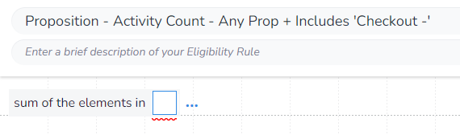
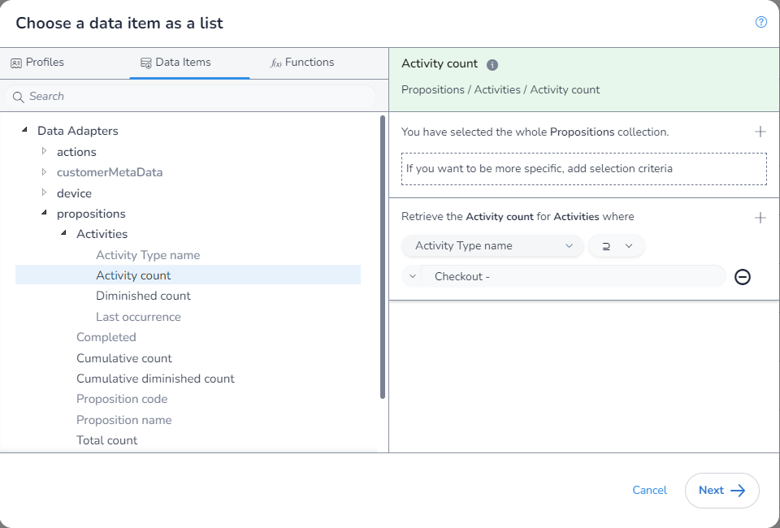

In this example, we will get the `Diminished Activity Count` where the `Proposition` can be anything and the `Activity Type` contains the text "Checkout -". This shows us how to get the `Diminished Activity Count` for any case where we want to match multiple `Activity Typex`, and the `Proposition` can be anything.

As we are aggrigating, we first need to select which aggrigation `function` we are using. We will be using `Sum of the elements in` to get the total number of times these `Activity Types` have be linked to an event.

You will notice that as we have used this `function`, when we extern the `DIP` we are limted to only fields that return a `number` and that we are not required to apply any filters:

We will leave the `Proposition` filter blank, and apply our `Activity Type` filter:

We can now save our rule. Also note how there are square brackets (`[]`) around the `function` input, this is because it is taking a list.

