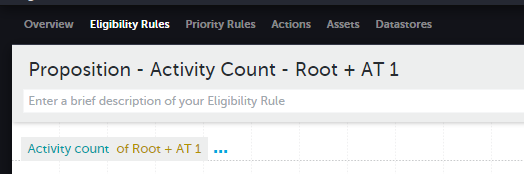

In this example, we will get the `Activity Count` where the `Proposition` is "Root" and the `Activity Type` is "AT 1". This shows us how to get the `Activity Count` for any case where we are exactly specifying the `Proposition` and the `Activity Type`.

As there is no aggrigation needed, we first open the `DIP`, select the field we want, and apply our filters:

We can now save our rule as this is all we need to do at this step.

This lets us check how many times the user has done this `Activity Type` for this `Proposition`.