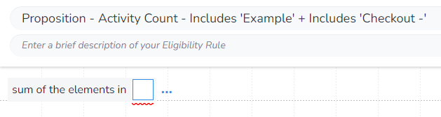
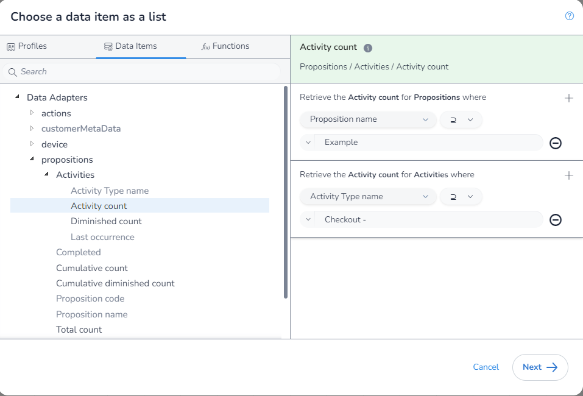
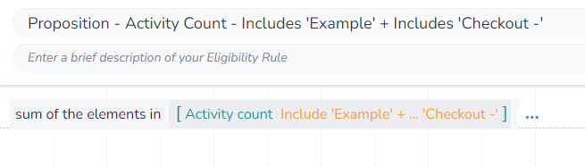

In this example, we will calculated the `Activity Count` where the `Proposition Name` contains "Example" and the `Activity Type` contains the text "Checkout -". This shows us how to calculated the `Activity Count` for any case where we want to match some, but not all, `Propositions` based of thier `Proposition Name` and we want to match multiple `Activity Types`.

The `Proposition Name` in the `Proposition` `Data Adapter` is actually the full `Proposition Path`. This means that when you using the `includes` filter, this will match the parent and all children and the `Proposition Path` of the child will contain the `Proposition Path` of the parent.

We will still refer to this as a `Cumulative Activity Count` even though this is not the field we are selecting. This is because we are going to be taking multiple `Activity Counts` and aggrigating them, thus giving us a `Cumulative Activity Count`. 

As we are aggrigating, we first need to select which aggrigation `function` we are using. We will be using `Sum of the elements in` to get the value of `Activity Counts` for each matching `Proposition` and `Activity Type`:

You will notice that as we have used this `function`, when we extern the `DIP` we are limted to only fields that return a `number` and that we are not required to apply any filters:

We will change the matching type of our `Proposition` filter to `includes` and input our value to match on and provide our `Activity Type`.

We can now save our rule. Also note how there are square brackets (`[]`) around the `function` input, this is because it is taking a list.

