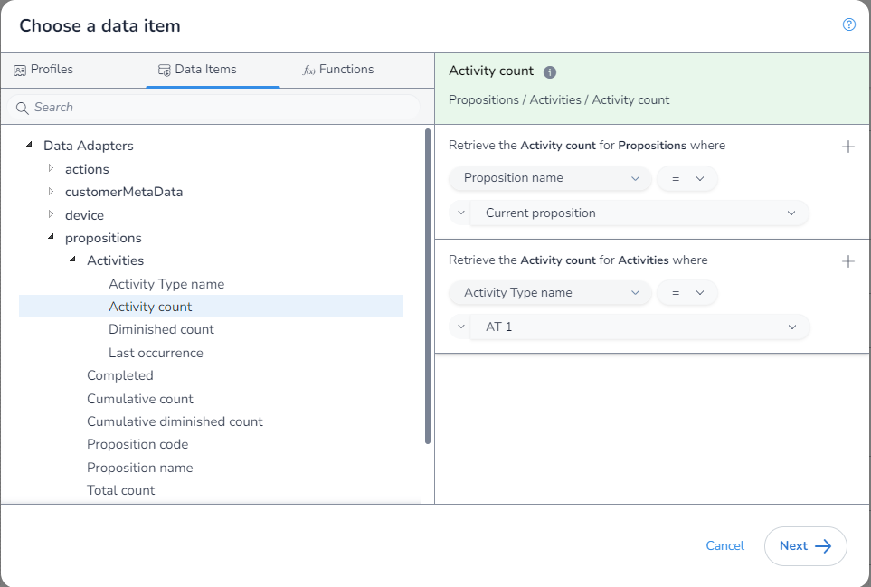
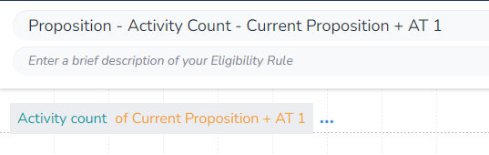

In this example, we will get the `Activity Count` where the `Proposition` is the Proposition we have assigned to our `Action` and the `Activity Type` is "AT 1". This shows us how to get the `Activity Count` for any case where we are exactly specifying the `Activity Type`, and the `Proposition` has been assigned to the action.

As there is no aggrigation needed, we first open the `DIP`, select the field we want, and apply our filter. We do this by using the option `Current proposition` in the drop down:

We can now save our rule 

