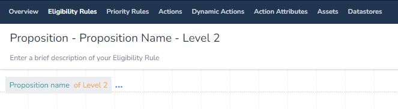
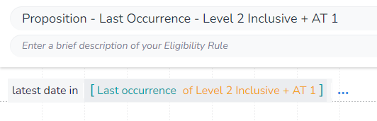

In this example, we will get the cumulative `Last Occurrence` where the `Proposition` includes "Level 2" and its children and the `Activity Type` is "AT 1". This shows us how to get the cumulative `Last Occurrence` for any case where we are exactly specifying the parent `Proposition` and the `Activity Type`.

The `Activity Type` section of the `Proposition Data Adapter` has no cumulative option, but we can replicate this functionality.

To do this we first need to create a supporting rule that gets us `Proposition Name` for the `Proposition` we want. The value of `Proposition Name` will include the full path uniquely identifying the selected `Proposition` and so will not match `Propositions` with the same name.

You can then save this rule:

This `Proposition Name` will match the parent `Proposition` and its children as we wanted it to. To make the set-up consistant with when we want to exclude the parent, we will wrap this rule in a new rule:

As we are aggrigating, we first need to select which aggrigation `function` we are using. We will be using `Latest date in` to get the total number of times this `Activity Type` has be linked to an event.

You will notice that as we have used this `function`, when we extern the `DIP` we are limted to only fields that return a `number` and that we are not required to apply any filters:

We will select the rule we made to get the `Proposition Path`, and apply our `Activity Type` filter:

We can now save our rule. Also note how there are square brackets (`[]`) around the `function` input, this is because it is taking a list.

