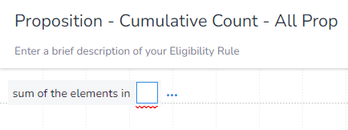
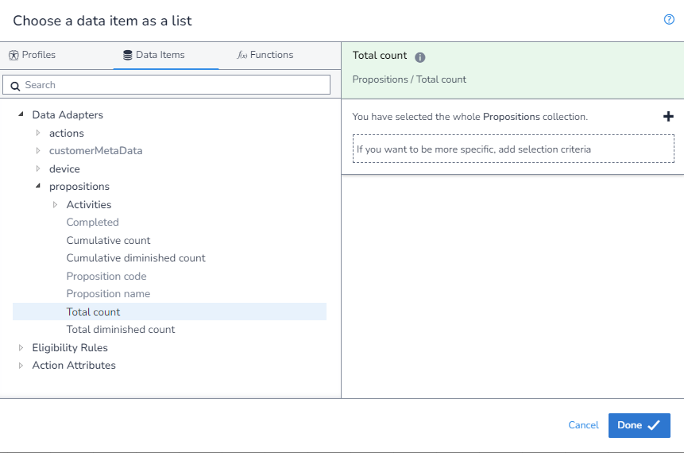

In this example, we will calculated the `Cumulative Count` of all `Propositions`. To do this, I would recommend using the Specific `Proposition` method and select the top level `Proposition`, but we will cover how to do it using the aggrigate method for completion.

We will still refer to this as a `Cumulative Count` even though this is not the field we are selecting. This is because we are going to be taking multiple `Total Counts` and aggrigating them, thus giving us a `Cumulative Count`. 

As we are aggrigating, we first need to select which aggrigation `function` we are using. We will be using `Sum of the elements in` to get the value of `Total Counts` for each matching `Proposition`:

You will notice that as we have used this `function`, when we extern the `DIP` we are limted to only fields that return a `number` and that we are not required to apply any filters:

We will leave the filter as it is so that all `Propositions` will be returned.

We can now save our rule. Also note how there are square brackets (`[]`) around the `function` input, this is because it is taking a list.

