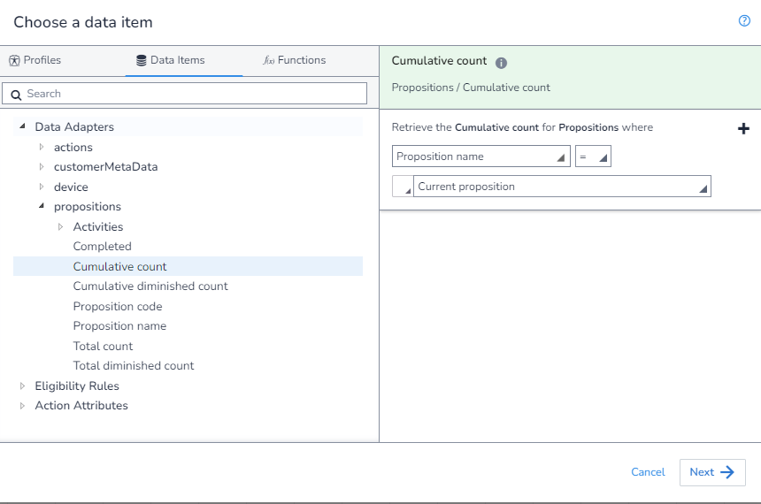
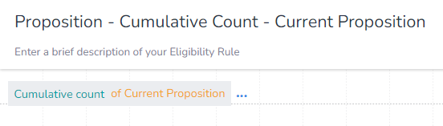

In this example, we will get the `Cumulative Count` where the `Proposition` is the Proposition we have assigned to our `Action`. We do this by using the option `Current proposition` in the drop down.

As there is no aggrigation needed, we first open the `DIP`, select the field we want, and apply our filter

We can now save our rule as this is all we need to do at this step.

