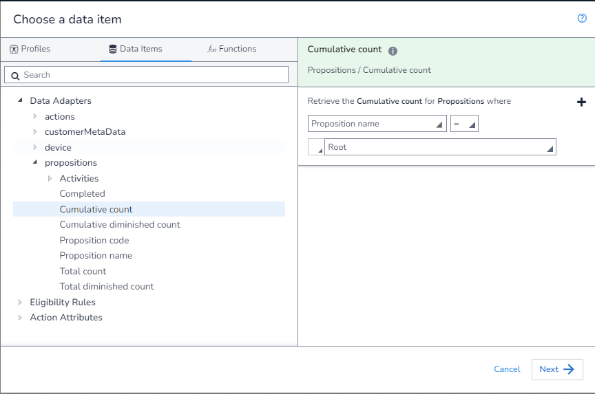
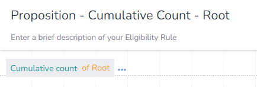

In this example, we will get the `Cumulative Count` where the `Proposition` is "Root". This shows us how to get the `Cumulative Count` for any case where we are exactly specifying the `Proposition`.

As there is no aggrigation needed, we first open the `DIP`, select the field we want, and apply our filter:

We can now save our rule as this is all we need to do at this step.

