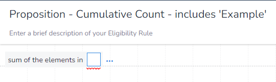
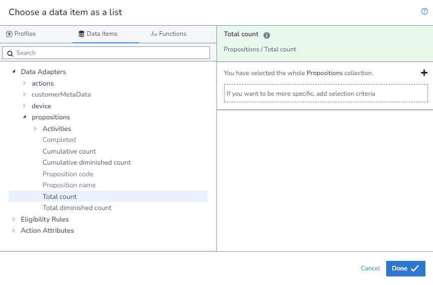
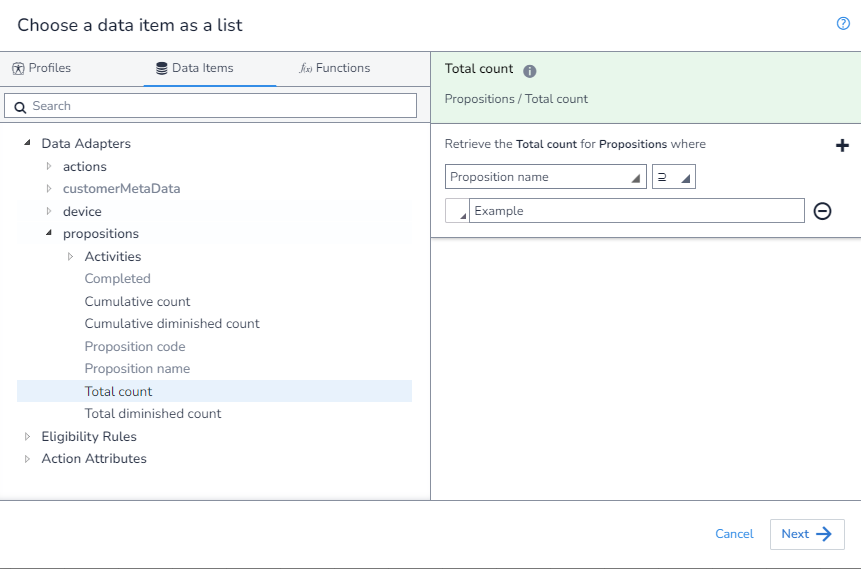
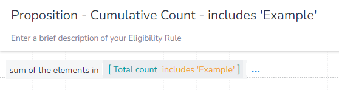

In this example, we will calculated the `Cumulative Count` where the `Proposition Name` contains a provided string. This shows us how to calculated the `Cumulative Count` for any case where we want to match some, but not all, `Propositions` based of thier `Proposition Name`. 

The `Proposition Name` in the `Proposition` `Data Adapter` is actually the full `Proposition Path`. This means that when you using the `includes` filter, this will match the parent and all children and the `Proposition Path` of the child will contain the `Proposition Path` of the parent. This means that you should only ever use `Total Counts` instead of `Cumulative Counts` when using the `Sum of the elements in` aggrigator with the `Includes` filter, otherwise you will count children `Propositions` multiple times.

We will still refer to this as a `Cumulative Count` even though this is not the field we are selecting. This is because we are going to be taking multiple `Total Counts` and aggrigating them, thus giving us a `Cumulative Count`. 

As we are aggrigating, we first need to select which aggrigation `function` we are using. We will be using `Sum of the elements in` to get the value of `Total Counts` for each matching `Proposition`:

You will notice that as we have used this `function`, when we extern the `DIP` we are limted to only fields that return a `number` and that we are not required to apply any filters:

We will change the matching type of our `Proposition` filter to `includes` and input our value to match on.

We can now save our rule. Also note how there are square brackets (`[]`) around the `function` input, this is because it is taking a list.

